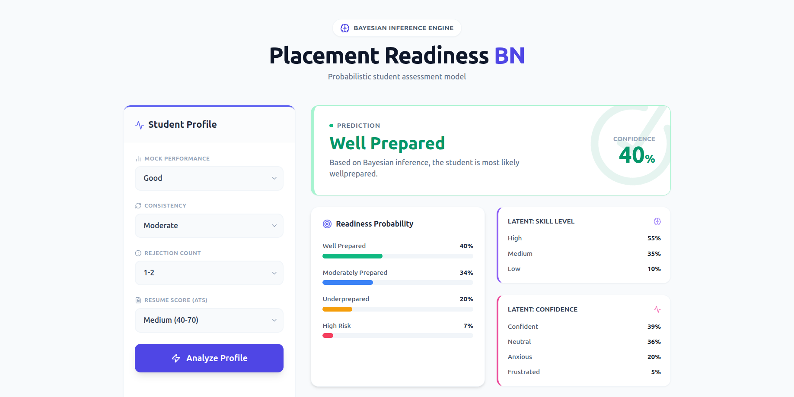
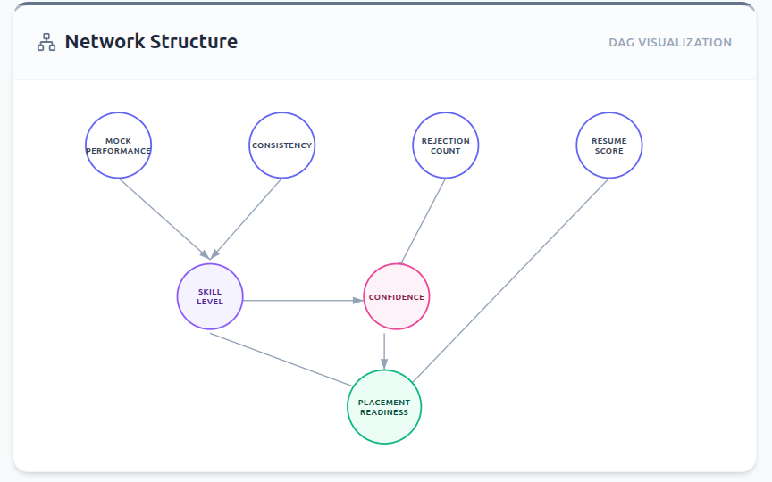

**Author:** Sangam Kumar Mishra (Roll: 22CS01071)

# Bayesian Estimation of Student Placement Readiness and Risk

---

## 1. Folder Structure

Assuming project root:

`Bayesian Estimation of Student Placement Readiness and Risk/`

```bash
Bayesian Estimation of Student Placement Readiness and Risk/
│
├── bayesian_network.py              # Main Bayesian Network implementation
├── custom_input.py                  # CLI script for manual/custom inputs
├── cpt_data.json                    # Conditional Probability Tables (CPTs)
├── bayesian_network_results.json    # Auto-generated results for test cases
├── requirements.txt                 # Python dependencies
│
└── my-app/                          # Vite + React frontend (UI)
    ├── index.html
    ├── package.json
    └── src/
        ├── App.jsx
        └── main.jsx
```

---

## 2. Installation and Setup

### 2.1 Prerequisites

* Python **3.8+**
* `pip` package manager
* Node.js + npm (for the UI)

---

### 2.2 Python Environment Setup


```bash
# (optional but recommended)
python -m venv venv
source venv/bin/activate      # Linux / macOS
# or
venv\Scripts\activate         # Windows
```

Install Python dependencies:

```bash
pip install -r requirements.txt
```

---

### 2.3 Frontend Setup (Vite + React)

```bash
cd my-app
npm install
```

This installs all frontend dependencies declared in `my-app/package.json`.

---

## 3. How to Run

### 3.1 Run Bayesian Network with Built-in Test Cases


```bash
python bayesian_network.py
```

This will:

* Load CPTs from `cpt_data.json`
* Print the network structure
* Run **4 predefined test cases**
* Print detailed assessment reports in the terminal
* Export numerical results to `bayesian_network_results.json`

---

### 3.2 Run with Custom Input (Terminal / CLI)

Run:

```bash
python custom_input.py
```

You will be prompted step by step, for example:

```text
Select Mock Performance:
1. Excellent
2. Good
3. Average
4. Poor

Select Preparation Consistency:
1. HighlyConsistent
2. Moderate
3. Irregular
4. Rare

Select Recent Rejections Count:
1. None
2. 1-2
3. 3-5
4. MoreThan5

Select Resume Quality (ATS Score Range):
1. High
2. Medium
3. Low
```

After you answer all prompts, the script prints a full **Placement Readiness Assessment Report**, and may optionally save it as `custom_input_report.txt`.

---

### 3.3 Run the UI (Vite + React)


```bash
cd my-app
npm run dev
```

By default, Vite will serve the app at:

```text
http://localhost:5173/
```

Open this URL in your browser to use the interactive student placement readiness UI.

---

## 4. Input / Output

### 4.1 Programmatic Input Format (Python)

Example of how the Bayesian Network expects evidence:

```python
from bayesian_network import BayesianNetwork

bn = BayesianNetwork("cpt_data.json")

evidence = {
    "MockPerformance": "Good",
    "Consistency": "Moderate",
    "Rejections": "1-2",
    "ResumeQuality": "Medium"
}

result = bn.inference(evidence)
report = bn.generate_report(evidence, result)
print(report)
```

Where the input fields are:

* `MockPerformance`: `Excellent`, `Good`, `Average`, `Poor`
* `Consistency`: `HighlyConsistent`, `Moderate`, `Irregular`, `Rare`
* `Rejections`: `None`, `1-2`, `3-5`, `MoreThan5`
* `ResumeQuality`: `High`, `Medium`, `Low`

### 4.2 Output Structure (Overview)

For each run, the system produces:

1. **Input Evidence** summary
2. **Inferred Skill Level** (distribution + most likely state)
3. **Inferred Confidence State** (distribution + most likely state)
4. **Placement Readiness** distribution and **Primary Assessment**
5. (Optional) **Identified Risk Factors**
6. **Recommended Actions**

---

## 5. Sample Test Cases and Reports with Analysis (from `bayesian_network.py`)

Below are the **exact reports** produced when running:

```bash
python bayesian_network.py
```

### 5.1 Test Case 1 – Well-Prepared Student with Strong Resume

```text
======================================================================
STUDENT PLACEMENT READINESS ASSESSMENT REPORT
======================================================================

INPUT EVIDENCE:
----------------------------------------------------------------------
  MockPerformance          : Excellent
  Consistency              : HighlyConsistent
  Rejections               : None
  ResumeQuality            : High (ATS Score: 71-100)

INFERRED SKILL LEVEL:
----------------------------------------------------------------------
  Most Likely State: High (85.00%)
  Probability Distribution:
    High           :  85.00% ██████████████████████████████████████████
    Medium         :  13.00% ██████
    Low            :   2.00% █

INFERRED CONFIDENCE STATE:
----------------------------------------------------------------------
  Most Likely State: Confident (66.50%)
  Probability Distribution:
    Confident      :  66.50% █████████████████████████████████
    Neutral        :  27.35% █████████████
    Anxious        :   4.94% ██
    Frustrated     :   1.21%

PLACEMENT READINESS ASSESSMENT:
======================================================================
  PRIMARY ASSESSMENT: WellPrepared (76.46%)

  Detailed Probability Distribution:
    WellPrepared        :  76.46% ██████████████████████████████████████
    ModeratelyPrepared  :  17.21% ████████
    Underprepared       :   4.64% ██
    HighRisk            :   1.68%

RECOMMENDED ACTIONS:
----------------------------------------------------------------------
  • Continue current preparation strategy
  • Focus on mock interviews with top companies
  • Work on advanced problem-solving

======================================================================
```

---

### 5.2 Test Case 2 – Average Student with Pressure and Weak Resume

```text
======================================================================
STUDENT PLACEMENT READINESS ASSESSMENT REPORT
======================================================================

INPUT EVIDENCE:
----------------------------------------------------------------------
  MockPerformance          : Average
  Consistency              : Irregular
  Rejections               : 3-5
  ResumeQuality            : Low (ATS Score: <40)

INFERRED SKILL LEVEL:
----------------------------------------------------------------------
  Most Likely State: Medium (50.00%)
  Probability Distribution:
    Medium         :  50.00% █████████████████████████
    Low            :  35.00% █████████████████
    High           :  15.00% ███████

INFERRED CONFIDENCE STATE:
----------------------------------------------------------------------
  Most Likely State: Anxious (39.95%)
  Probability Distribution:
    Anxious        :  39.95% ███████████████████
    Neutral        :  25.50% ████████████
    Frustrated     :  20.80% ██████████
    Confident      :  13.75% ██████

PLACEMENT READINESS ASSESSMENT:
======================================================================
  PRIMARY ASSESSMENT: Underprepared (41.57%)

  Detailed Probability Distribution:
    Underprepared       :  41.57% ████████████████████
    HighRisk            :  32.49% ████████████████
    ModeratelyPrepared  :  18.58% █████████
    WellPrepared        :   7.36% ███

IDENTIFIED RISK FACTORS:
----------------------------------------------------------------------
  1. High rejection count affecting psychological state
  2. Inconsistent preparation pattern detected
  3. Technical skills need significant improvement
  4. Resume quality below ATS threshold (ATS score < 40)
  5. High probability of stress/frustration detected
  6. CRITICAL: Requires immediate intervention and support

RECOMMENDED ACTIONS:
----------------------------------------------------------------------
  • URGENT: Develop structured preparation plan
  • Daily practice schedule needed
  • Consider placement coaching/mentorship
  • Focus on fundamental concepts
  • Resume rewrite required (current ATS score insufficient)

======================================================================
```

---

### 5.3 Test Case 3 – High-Risk Student (Critical Intervention Needed)

```text
======================================================================
STUDENT PLACEMENT READINESS ASSESSMENT REPORT
======================================================================

INPUT EVIDENCE:
----------------------------------------------------------------------
  MockPerformance          : Poor
  Consistency              : Rare
  Rejections               : MoreThan5
  ResumeQuality            : Low (ATS Score: <40)

INFERRED SKILL LEVEL:
----------------------------------------------------------------------
  Most Likely State: Low (80.00%)
  Probability Distribution:
    Low            :  80.00% ████████████████████████████████████████
    Medium         :  18.00% █████████
    High           :   2.00% █

INFERRED CONFIDENCE STATE:
----------------------------------------------------------------------
  Most Likely State: Frustrated (45.80%)
  Probability Distribution:
    Frustrated     :  45.80% ██████████████████████
    Anxious        :  40.90% ████████████████████
    Neutral        :   9.16% ████
    Confident      :   4.14% ██

PLACEMENT READINESS ASSESSMENT:
======================================================================
  PRIMARY ASSESSMENT: HighRisk (54.28%)

  Detailed Probability Distribution:
    HighRisk            :  54.28% ███████████████████████████
    Underprepared       :  37.42% ██████████████████
    ModeratelyPrepared  :   6.83% ███
    WellPrepared        :   1.47%

IDENTIFIED RISK FACTORS:
----------------------------------------------------------------------
  1. High rejection count affecting psychological state
  2. Inconsistent preparation pattern detected
  3. Technical skills need significant improvement
  4. Resume quality below ATS threshold (ATS score < 40)
  5. High probability of stress/frustration detected
  6. Low skill level requires intensive training
  7. CRITICAL: Requires immediate intervention and support

RECOMMENDED ACTIONS:
----------------------------------------------------------------------
  • CRITICAL: Immediate intervention required
  • Meet with placement officer/counselor
  • Consider stress management support
  • Intensive skill development program needed
  • Professional resume writing service recommended
  • Explore alternative career paths if needed

======================================================================
```

---

### 5.4 Test Case 4 – Good Skills Held Back by Poor Resume

```text
======================================================================
STUDENT PLACEMENT READINESS ASSESSMENT REPORT
======================================================================

INPUT EVIDENCE:
----------------------------------------------------------------------
  MockPerformance          : Good
  Consistency              : Moderate
  Rejections               : 1-2
  ResumeQuality            : Low (ATS Score: <40)

INFERRED SKILL LEVEL:
----------------------------------------------------------------------
  Most Likely State: High (55.00%)
  Probability Distribution:
    High           :  55.00% ███████████████████████████
    Medium         :  35.00% █████████████████
    Low            :  10.00% █████

INFERRED CONFIDENCE STATE:
----------------------------------------------------------------------
  Most Likely State: Confident (39.00%)
  Probability Distribution:
    Confident      :  39.00% ███████████████████
    Neutral        :  36.25% ██████████████████
    Anxious        :  19.85% █████████
    Frustrated     :   4.90% ██

PLACEMENT READINESS ASSESSMENT:
======================================================================
  PRIMARY ASSESSMENT: Underprepared (30.94%)

  Detailed Probability Distribution:
    Underprepared       :  30.94% ███████████████
    ModeratelyPrepared  :  29.66% ██████████████
    WellPrepared        :  25.66% ████████████
    HighRisk            :  13.73% ██████

IDENTIFIED RISK FACTORS:
----------------------------------------------------------------------
  1. Resume quality below ATS threshold (ATS score < 40)
  2. Skill level strong, but resume bottleneck significantly reduces readiness
  3. Mild psychological vulnerability detected (Anxious + Frustrated ~ 25%)

RECOMMENDED ACTIONS:
----------------------------------------------------------------------
  • Resume rewrite is the fastest high-impact improvement
  • Strengthen project descriptions and ATS keywords
  • Continue current preparation rhythm
  • Apply to companies that shortlist based on skills, not strict ATS thresholds
  • Improve competitive programming consistency

======================================================================
```

## 6. Running Custom Test Cases

You can run your own interactive test cases using:

```bash
python custom_input.py
```

Below is a sample execution and the resulting report.

```text
======================================================================
 CUSTOM INPUT: STUDENT PLACEMENT READINESS PREDICTOR
======================================================================
✓ Successfully loaded CPTs from cpt_data.json
  Network version: 2.0
  Total nodes: 7
  Evidence nodes: 4

Select Mock Performance:
  1. Excellent
  2. Good
  3. Average
  4. Poor

Enter choice number: 1

Select Preparation Consistency:
  1. HighlyConsistent
  2. Moderate
  3. Irregular
  4. Rare

Enter choice number: 2

Select Recent Rejections Count:
  1. None
  2. 1-2
  3. 3-5
  4. MoreThan5

Enter choice number: 2

Select Resume Quality (ATS Score Range):
  1. High
  2. Medium
  3. Low

Enter choice number: 1

Running Bayesian Inference...

======================================================================
STUDENT PLACEMENT READINESS ASSESSMENT REPORT
======================================================================

INPUT EVIDENCE:
----------------------------------------------------------------------
  MockPerformance          : Excellent
  Consistency              : Moderate
  Rejections               : 1-2
  ResumeQuality            : High (ATS Score: 71-100)

INFERRED SKILL LEVEL:
----------------------------------------------------------------------
  Most Likely State: High (75.00%)
  Probability Distribution:
    High           :  75.00% █████████████████████████████████████
    Medium         :  20.00% ██████████
    Low            :   5.00% ██

INFERRED CONFIDENCE STATE:
----------------------------------------------------------------------
  Most Likely State: Confident (44.00%)
  Probability Distribution:
    Confident      :  44.00% ██████████████████████
    Neutral        :  35.75% █████████████████
    Anxious        :  16.25% ████████
    Frustrated     :   4.00% ██

PLACEMENT READINESS ASSESSMENT:
======================================================================
  PRIMARY ASSESSMENT: WellPrepared (64.45%)

  Detailed Probability Distribution:
    WellPrepared        :  64.45% ████████████████████████████████
    ModeratelyPrepared  :  23.46% ███████████
    Underprepared       :   9.05% ████
    HighRisk            :   3.04% █

RECOMMENDED ACTIONS:
----------------------------------------------------------------------
  • Continue current preparation strategy
  • Focus on mock interviews with top companies
  • Work on advanced problem-solving

======================================================================

Do you want to save this report? (y/n): y
✓ Report saved as 'custom_input_report.txt'
```

### Saved Report (custom_input_report.txt)

```text
======================================================================
STUDENT PLACEMENT READINESS ASSESSMENT REPORT
======================================================================

INPUT EVIDENCE:
----------------------------------------------------------------------
  MockPerformance          : Excellent
  Consistency              : Moderate
  Rejections               : 1-2
  ResumeQuality            : High (ATS Score: 71-100)

INFERRED SKILL LEVEL:
----------------------------------------------------------------------
  Most Likely State: High (75.00%)
  Probability Distribution:
    High           :  75.00% █████████████████████████████████████
    Medium         :  20.00% ██████████
    Low            :   5.00% ██

INFERRED CONFIDENCE STATE:
----------------------------------------------------------------------
  Most Likely State: Confident (44.00%)
  Probability Distribution:
    Confident      :  44.00% ██████████████████████
    Neutral        :  35.75% █████████████████
    Anxious        :  16.25% ████████
    Frustrated     :   4.00% ██

PLACEMENT READINESS ASSESSMENT:
======================================================================
  PRIMARY ASSESSMENT: WellPrepared (64.45%)

  Detailed Probability Distribution:
    WellPrepared        :  64.45% ████████████████████████████████
    ModeratelyPrepared  :  23.46% ███████████
    Underprepared       :   9.05% ████
    HighRisk            :   3.04% █

RECOMMENDED ACTIONS:
----------------------------------------------------------------------
  • Continue current preparation strategy
  • Focus on mock interviews with top companies
  • Work on advanced problem-solving

======================================================================
```

## 7. Interactive UI

To run the frontend UI:

```bash
cd my-app
npm run dev
```

By default, the app runs at:
[http://localhost:5173/](http://localhost:5173/)

### 7.1 Home Screen


### 7.2 Results Screen



---

## 8. Bayesian Network Structure

### 7.1 Overview

The Bayesian Network used in this project contains **7 nodes** capturing both technical and psychological factors influencing placement readiness.

#### **Evidence Nodes (Observed Inputs)**

These are directly provided by the student/user:

* **MockPerformance** — {Excellent, Good, Average, Poor}
* **Consistency** — {HighlyConsistent, Moderate, Irregular, Rare}
* **Rejections** — {None, 1-2, 3-5, MoreThan5}
* **ResumeQuality (ATS Score)** — {High, Medium, Low}

#### **Hidden / Latent Nodes**

Internal nodes inferred by the BN:

* **SkillLevel** — {High, Medium, Low}

  * *Parents:* MockPerformance, Consistency
* **ConfidenceState** — {Confident, Neutral, Anxious, Frustrated}

  * *Parents:* SkillLevel, Rejections

#### **Target Node (Final Prediction)**

* **PlacementReadiness** — {WellPrepared, ModeratelyPrepared, Underprepared, HighRisk}

  * *Parents:* SkillLevel, ConfidenceState, ResumeQuality

---

### 7.2 Network Edges (Causal Relationships)

The BN uses the following causal dependencies:

* MockPerformance → SkillLevel
* Consistency → SkillLevel
* Rejections → ConfidenceState
* SkillLevel → ConfidenceState
* SkillLevel → PlacementReadiness
* ConfidenceState → PlacementReadiness
* ResumeQuality → PlacementReadiness

This forms a **3‑layer probabilistic causal model**:

```
Evidence → Hidden (Latent) → Target Outcome
```

---
# Causal Edges

| Causal Edge                              | Reason                                                   |
| ---------------------------------------- | ------------------------------------------------------------------- |
| **MockPerformance → SkillLevel**         | Better mock scores indicate stronger technical ability.             |
| **Consistency → SkillLevel**             | Regular and disciplined practice develops stronger skills.          |
| **Rejections → ConfidenceState**         | More rejections reduce confidence and increase anxiety/frustration. |
| **SkillLevel → ConfidenceState**         | Higher skill boosts confidence; low skill creates self-doubt.       |
| **SkillLevel → PlacementReadiness**      | Strong technical foundations directly improve placement success.    |
| **ConfidenceState → PlacementReadiness** | Confident students perform better in interviews than anxious ones.  |
| **ResumeQuality → PlacementReadiness**   | Strong resumes increase shortlisting probability and readiness.     |


### 7.3 DAG Visualization



---

## 8. CPT Tables (from `cpt_data.json`)

This project uses a JSON file (`cpt_data.json`) to store all prior and conditional probability tables (CPTs) for the Bayesian Network.

### 8.1 Prior Probabilities
### MockPerformance

| State     | Probability |
| --------- | ----------- |
| Excellent | 0.15        |
| Good      | 0.30        |
| Average   | 0.40        |
| Poor      | 0.15        |

### Consistency

| State            | Probability |
| ---------------- | ----------- |
| HighlyConsistent | 0.20        |
| Moderate         | 0.35        |
| Irregular        | 0.30        |
| Rare             | 0.15        |

### Rejections

| State     | Probability |
| --------- | ----------- |
| None      | 0.25        |
| 1-2       | 0.35        |
| 3-5       | 0.25        |
| MoreThan5 | 0.15        |

### ResumeQuality (ATS)

| State  | Probability | ATS Range |
| ------ | ----------- | --------- |
| High   | 0.25        | 71–100    |
| Medium | 0.50        | 41–70     |
| Low    | 0.25        | 0–40      |

---

### 8.2 CPT – SkillLevel

### P(SkillLevel | MockPerformance, Consistency)

| MockPerformance | Consistency      | High | Medium | Low  |
| --------------- | ---------------- | ---- | ------ | ---- |
| Excellent       | HighlyConsistent | 0.85 | 0.13   | 0.02 |
| Excellent       | Moderate         | 0.75 | 0.20   | 0.05 |
| Excellent       | Irregular        | 0.55 | 0.35   | 0.10 |
| Excellent       | Rare             | 0.35 | 0.45   | 0.20 |
| Good            | HighlyConsistent | 0.70 | 0.25   | 0.05 |
| Good            | Moderate         | 0.55 | 0.35   | 0.10 |
| Good            | Irregular        | 0.35 | 0.45   | 0.20 |
| Good            | Rare             | 0.20 | 0.45   | 0.35 |
| Average         | HighlyConsistent | 0.45 | 0.45   | 0.10 |
| Average         | Moderate         | 0.30 | 0.50   | 0.20 |
| Average         | Irregular        | 0.15 | 0.50   | 0.35 |
| Average         | Rare             | 0.08 | 0.37   | 0.55 |
| Poor            | HighlyConsistent | 0.20 | 0.50   | 0.30 |
| Poor            | Moderate         | 0.10 | 0.40   | 0.50 |
| Poor            | Irregular        | 0.05 | 0.25   | 0.70 |
| Poor            | Rare             | 0.02 | 0.18   | 0.80 |

---

### 8.3 CPT – ConfidenceState
### P(ConfidenceState | Rejections, SkillLevel)

| Rejections | SkillLevel | Confident | Neutral | Anxious | Frustrated |
| ---------- | ---------- | --------- | ------- | ------- | ---------- |
| None       | High       | 0.70      | 0.25    | 0.04    | 0.01       |
| None       | Medium     | 0.50      | 0.40    | 0.08    | 0.02       |
| None       | Low        | 0.25      | 0.45    | 0.25    | 0.05       |
| 1-2        | High       | 0.50      | 0.35    | 0.12    | 0.03       |
| 1-2        | Medium     | 0.30      | 0.40    | 0.25    | 0.05       |
| 1-2        | Low        | 0.10      | 0.30    | 0.45    | 0.15       |
| 3-5        | High       | 0.30      | 0.35    | 0.28    | 0.07       |
| 3-5        | Medium     | 0.15      | 0.30    | 0.40    | 0.15       |
| 3-5        | Low        | 0.05      | 0.15    | 0.45    | 0.35       |
| MoreThan5  | High       | 0.15      | 0.25    | 0.40    | 0.20       |
| MoreThan5  | Medium     | 0.08      | 0.17    | 0.45    | 0.30       |
| MoreThan5  | Low        | 0.03      | 0.07    | 0.40    | 0.50       |

---

### 8.4 CPT – PlacementReadiness 
## P(PlacementReadiness | SkillLevel, ConfidenceState, ResumeQuality)

| SkillLevel | ConfidenceState | ResumeQuality | WellPrepared | ModeratelyPrepared | Underprepared | HighRisk |
| ---------- | --------------- | ------------- | ------------ | ------------------ | ------------- | -------- |
| High       | Confident       | High          | 0.90         | 0.08               | 0.01          | 0.01     |
| High       | Confident       | Medium        | 0.75         | 0.20               | 0.04          | 0.01     |
| High       | Confident       | Low           | 0.55         | 0.30               | 0.12          | 0.03     |
| High       | Neutral         | High          | 0.75         | 0.20               | 0.04          | 0.01     |
| High       | Neutral         | Medium        | 0.60         | 0.30               | 0.08          | 0.02     |
| High       | Neutral         | Low           | 0.40         | 0.35               | 0.20          | 0.05     |
| High       | Anxious         | High          | 0.55         | 0.30               | 0.10          | 0.05     |
| High       | Anxious         | Medium        | 0.40         | 0.35               | 0.20          | 0.05     |
| High       | Anxious         | Low           | 0.25         | 0.35               | 0.30          | 0.10     |
| High       | Frustrated      | High          | 0.30         | 0.45               | 0.20          | 0.05     |
| High       | Frustrated      | Medium        | 0.20         | 0.40               | 0.30          | 0.10     |
| High       | Frustrated      | Low           | 0.10         | 0.30               | 0.40          | 0.20     |
| Medium     | Confident       | High          | 0.50         | 0.40               | 0.08          | 0.02     |
| Medium     | Confident       | Medium        | 0.30         | 0.50               | 0.17          | 0.03     |
| Medium     | Confident       | Low           | 0.15         | 0.40               | 0.35          | 0.10     |
| Medium     | Neutral         | High          | 0.35         | 0.45               | 0.17          | 0.03     |
| Medium     | Neutral         | Medium        | 0.25         | 0.45               | 0.25          | 0.05     |
| Medium     | Neutral         | Low           | 0.10         | 0.35               | 0.40          | 0.15     |
| Medium     | Anxious         | High          | 0.15         | 0.40               | 0.35          | 0.10     |
| Medium     | Anxious         | Medium        | 0.10         | 0.35               | 0.40          | 0.15     |
| Medium     | Anxious         | Low           | 0.03         | 0.20               | 0.52          | 0.25     |
| Medium     | Frustrated      | High          | 0.05         | 0.30               | 0.45          | 0.20     |
| Medium     | Frustrated      | Medium        | 0.03         | 0.25               | 0.47          | 0.25     |
| Medium     | Frustrated      | Low           | 0.01         | 0.15               | 0.45          | 0.39     |
| Low        | Confident       | High          | 0.25         | 0.45               | 0.25          | 0.05     |
| Low        | Confident       | Medium        | 0.20         | 0.40               | 0.30          | 0.10     |
| Low        | Confident       | Low           | 0.10         | 0.30               | 0.40          | 0.20     |
| Low        | Neutral         | High          | 0.15         | 0.40               | 0.35          | 0.10     |
| Low        | Neutral         | Medium        | 0.10         | 0.35               | 0.40          | 0.15     |
| Low        | Neutral         | Low           | 0.01         | 0.09               | 0.45          | 0.45     |
| Low        | Anxious         | High          | 0.10         | 0.30               | 0.40          | 0.20     |
| Low        | Anxious         | Medium        | 0.05         | 0.20               | 0.45          | 0.30     |
| Low        | Anxious         | Low           | 0.02         | 0.10               | 0.40          | 0.48     |
| Low        | Frustrated      | High          | 0.05         | 0.25               | 0.40          | 0.30     |
| Low        | Frustrated      | Medium        | 0.03         | 0.15               | 0.40          | 0.42     |
| Low        | Frustrated      | Low           | 0.00         | 0.02               | 0.28          | 0.70     |
---
