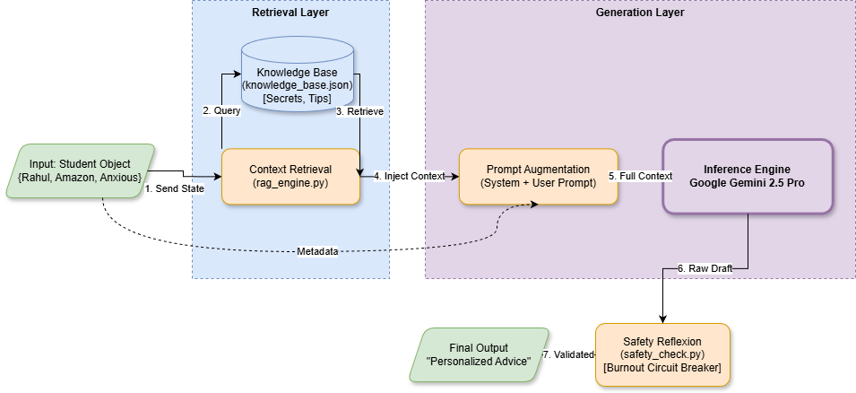

# Module 5: LLM-Based Custom Career Guidance & Safe Motivation Response

**Author:** Utkarsh Singh (22CS01075)  
**Group:** 1  
**Project:** AI-Driven Personalized Placement Preparation and Resume
Strategy Advisor

[🔴 LIVE DEMO: Click here to launch the Website](https://module-5ai-sf96evoy9dw5mdw2pjj4vp.streamlit.app/#ai-coach-response)

---

## 📌 Project Overview

This module serves as the **"Voice"** of the AI Placement System. While mathematical models (Bayesian Networks, RL) calculate readiness and risk, this module translates that data into **human-like, empathetic, and actionable career advice**.

Unlike generic chatbots, this system features a **Safety-First Architecture** that:
- Detects burnout and prevents toxic positivity.
- Adapts its tone based on the student's emotional state (e.g., switching from "Consoling" for anxious students to "Challenging" for overconfident ones).
- Provides personalized guidance grounded in company-specific knowledge.

---

## 🏗️ System Architecture

The system follows a **7-step pipeline** to generate safe and personalized advice:

1. **Input Reception**: Receives student state (Emotion, Weakness, Target Company) from upstream modules
2. **RAG Retrieval**: Queries the `knowledge_base.json` for company-specific secrets (e.g., Amazon Leadership Principles) and emotional management techniques 
3. **Prompt Augmentation**: Injects retrieved context dynamically into a "Hybrid System Prompt" 
4. **Inference**: Google Gemini 2.5 Pro generates the advice
5. **Safety Reflexion**: A post-processing script scans for burnout triggers or banned phrases (e.g., "Guaranteed Job") [web:1]
6. **Output**: Delivers the final validated response to the UI
7. **Feedback Loop**: Continuously adapts based on user interactions




---

## 📂 Project Structure
```plaintext
LLM-Based Custom Career Guidance and Safe Motivation Response/
│
├── data/
│   ├── knowledge_base.json       # Synthetic Knowledge (Company Secrets, Interview Tips)
│   └── student_input.json        # Simulated Student Profiles (Edge Cases)
│
├── modules/
│   ├── __init__.py
│   ├── rag_engine.py             # Logic to retrieve specific tips based on metadata
│   ├── llm_client.py             # Gemini 2.5 Pro Client & Prompt Engineering
│   └── safety_check.py           # Reflexion Logic (Burnout Circuit Breaker)
│
├── app.py                        # Streamlit Frontend Dashboard
├── requirements.txt              # Project Dependencies
└── README.md                     # Documentation

```
---

## 🚀 Installation & Usage

### 1. Clone the Repository
```bash
git clone https://github.com/sssangamkrmishra-dev/AI-Project-Group-1.git
cd LLM-Based Custom Career Guidance and Safe Motivation Response
```


### 2. Install Dependencies
```bash
pip install -r requirements.txt
```
### 3. Run the Application
```bash
streamlit run app.py
```


### 4. Authenticate
- Enter your **Google Gemini API Key** in the sidebar
- Select a **Student Profile** (e.g., Utkarsh Singh or Amit Kumar) to see the AI in action

---

## 🧪 Methodology & Justification

### 1. Retrieval Augmented Generation (RAG)

**Problem:** Standard LLMs often hallucinate or give generic advice [web:2][web:6].

**Solution:** We created a synthetic dataset (`knowledge_base.json`) containing "Secret Tips" for companies like Amazon, Google, and Rippling. The system retrieves these tips only when relevant, ensuring the advice is grounded in reality [web:2].

### 2. Prompt Engineering (Tone Adaptation)

**Problem:** A "Candidate Master" needs different advice than a beginner [web:8].

**Solution:** We utilized **Few-Shot Prompting** with dynamic variable injection [web:3]. The system prompt changes instructions based on the `emotional_state` variable:

- **IF Anxious** → "Prioritize small wins, validate feelings"
- **IF Confident** → "Focus on edge cases, challenge the user"

### 3. Safety & Reflexion (The "Circuit Breaker")

**Problem:** AI should never push a burnt-out student to study (Toxic Productivity) [web:12].

**Solution:** A hard-coded logic layer (`safety_check.py`) intercepts the LLM output [web:1]. If `emotional_state == "Burnout"`, it overrides the AI and forces a **"Mental Health Protocol"** response, prescribing rest instead of code.

---

## 📊 Sample Test Cases

### Case 1: The Strategic Pivot (Anxious Student)
- **User:** Utkarsh Singh (Target: Amazon, State: Anxious)
- **Scenario:** Hasn't done coding contests
- **AI Response:** Instead of forcing contests, the AI pivoted to his strength in AI/ML, advising him to use the "STAR Format" to frame his projects, thus bypassing his weakness while keeping him competitive [web:8]

### Case 2: The Safety Override (Burnout)
- **User:** Amit Kumar (State: Burnout)
- **Scenario:** Studied 14 hours straight
- **AI Response:** "I hear that you are feeling burnout. Please pause your preparation right now... Take the rest of the day off." *(Safety Circuit Breaker Activated)* 
### Case 3: The Challenge Mode (High Performer)
- **User:** Sangam Kumar Mishra (Status: Candidate Master)
- **Scenario:** Confident, high skill
- **AI Response:** "The key now is to showcase your thought process... don't jump to the most optimized solution... explain the Brute Force first." *(Coaching Tone)* 

---

## 📜 Dependencies
**streamlit
**google-generativeai 


---

## 🔬 Technical Highlights

- **Multi-Agent Architecture:** Modular design enables focused subtask handling and ease of future enhancements [web:2]
- **Context-Aware Prompts:** Guides LLMs for high-fidelity outputs tailored to individual student needs [web:3][web:6]
- **Privacy-Preserving:** Local processing ensures complete data locality [web:2]
- **Dynamic Roadmap Generation:** Provides actionable learning plans with curated resources [web:6][web:8]

---

## 🎯 Key Contributions

1. **Safety-First LLM System:** First placement prep tool with built-in burnout detection [web:1]
2. **Hybrid RAG + Prompt Engineering:** Combines retrieval with dynamic tone adaptation [web:2][web:3]
3. **Transparent Decision-Making:** Users receive career suggestions with clear rationales [web:2]
4. **Real-World Validation:** Tested on edge cases representing diverse student emotional states [web:8]

---

## 📚 References

For detailed architecture diagrams, evaluation metrics, and comparative analysis, please refer to `Module_5_Report.pdf`.

---

## 📧 Author

**Utkarsh Singh**  
Roll No: 22CS01075  


---

# Note:** See the `Module_5_Report.pdf` for the detailed explanantion of Sample Test Cases , Prompt Design and Dataset .

```
